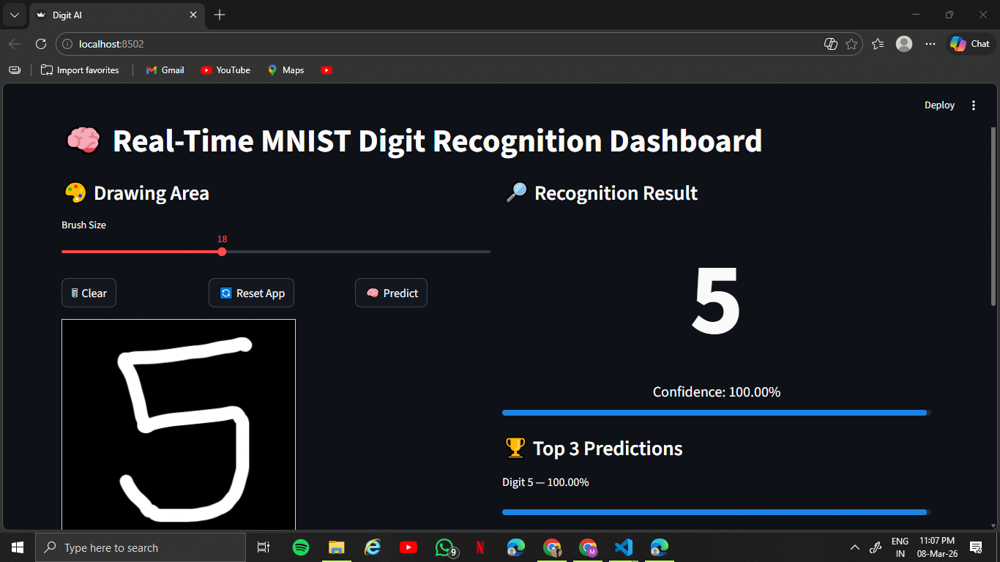

# MNIST Digit Recognition Dashboard

This project is a real-time handwritten digit recognition web application built using **TensorFlow, CNN, and Streamlit**.  
The model is trained on the **MNIST dataset** and allows users to draw digits directly on the screen to get instant predictions.

## Features:
- Real-time handwritten digit recognition
- Interactive drawing canvas
- Adjustable brush size
- Predict digits using a trained CNN model
- Displays prediction confidence
- Shows Top 3 most probable digits
- Processed 28x28 digit preview
- Download processed digit image
- Clear canvas and reset app functionality

## Tech Stack

- Python
- TensorFlow / Keras
- OpenCV
- NumPy
- Streamlit
- Streamlit Drawable Canvas

## How It Works

1. Draw a digit (0–9) on the canvas.
2. Click the **Predict** button.
3. The drawing is converted into a **28x28 grayscale image**.
4. The trained CNN model predicts the digit.
5. The predicted digit and confidence score are displayed.

## Model

The model is a **Convolutional Neural Network (CNN)** trained on the MNIST dataset, which contains **70,000 images of handwritten digits (0–9)**.

## Installation

Clone the repository:
```bash
git clone https://github.com/krishna-srivastava/mnist-digit-recognition-dashboard.git
cd mnist-digit-recognition-dashboard
```

Install dependencies:
```bash
pip install -r requirements.txt
```

Run the application:
```bash
streamlit run app.py
```

## App Preview:


## Goal of the Project:
The goal of this project is to demonstrate how deep learning models can be integrated with interactive web applications to create real-time AI tools.

## Author:
Krishna Srivastava
